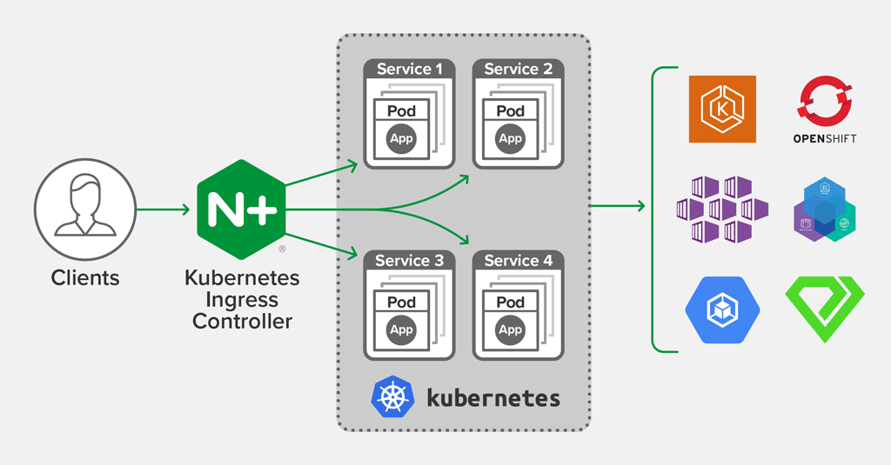
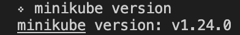
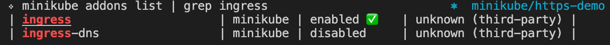
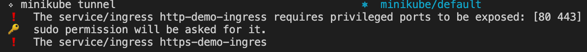
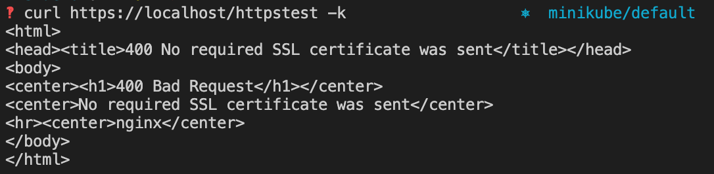
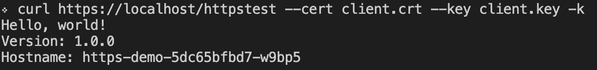

# ingress-nginx-mtls-demo



*image from [Nginx](https://www.nginx.com/blog/announcing-nginx-ingress-controller-for-kubernetes-release-1-6-0/)* 

## Step 1: Set up and start minikube

First things first, check to see if you have minikube installed and if the version is >= v1.19

``` minikube version ```



If not installed follow the docs: https://minikube.sigs.k8s.io/docs/start/

once you confirm you have minikube installed, run the follow commands: 

to start minikube: ``` minikube start ```

to enable the ingress addon: ``` minikube addons enable ingress ```

if you want to confirm it is enabled run: ```minikube addons list | grep ingress ```



You will see the green checkmark beside enabled ✅

**after enabling the ingress add on it will show you a message that says:**

please run "minikube tunnel" and your ingress resources would be available at "127.0.0.1".

We will do that in a later step or if you wish to do it now, feel free to run it in another terminal.

## Step 2: Set up your yaml files

We will be working with 3 yaml files:

1. ingress.yml - this is the ingress resource that the controller will be using to configure routes to send requests too.
2. service.yml - this is the service that the ingress resource is pointing to, it sits infront of your pods / deployments and routes traffic to them.
3. deployment.yml - this is the actual pod / endpoint you're trying to get your traffic too that serves your application content.

If you have cloned this repo, then you will have all 3 of these yaml files in your folder, if not copy them over now.

Let's also create a new namespace and switch into it before creating our resources:

create namespace: ``` kubectl create ns https-demo ```
switch into new namespace: ``` kubectl config set-context --current --namespace=https-demo ``

Then run ``` kubectl apply -f ingress.yml ```
and two more time for the other 2 yml files.

This command will create each resource for you in your cluster.

At this point you can also start the ```minikube tunnel``` command in a seperate terminal so that your requests will be forwarded to localhost correctly.



## Step 3: Setting up your self signed CA and server certificate

We will be using our own self signed CA to sign both our server and client certificates using openSSL. 

To learn more about openSSL check out there page here: openssl.org

Generate the CA and CA Key: 

``` openssl req -x509 -sha256 -newkey rsa:4096 -keyout ca.key -out ca.crt -days 365 -nodes -subj '/CN=Demo Authority' ```

1. the -x509 flag outputs a self signed certificate instead of a certificate request
2. the -sha256 flag specifies the hash function for our self signed certificate.
3. newkey flag creates our new RSA private key with 4096 bits
4. keyout flag points to what the keys file name will be
5. out flag is the certificate file name for our CA
6. days flag is how long the cert is valid for
7. nodes flag will not encrypt the private key that is created
8. subj flag will set the CN name and avoid any additional prompts

once it's created you can view your certificate by running the command and verifying things like sha256 RSA being used, CA=True, etc:

``` openssl x509 -noout -text -in ca.crt ```

Generate the Server CSR, Cert and Key:

This command creates our server certificate signing request that we will ask the CA we made to sign.

``` openssl req -new -newkey rsa:4096 -keyout server.key -out server.csr -nodes -subj '/CN=localhost' ```

This is the signing command to create our finished server certificate:

``` openssl x509 -req -sha256 -days 365 -in server.csr -CA ca.crt -CAkey ca.key -set_serial 01 -out server.crt ```

## Step 4: Create the secret

Now that we have our certificates for the server we need to put them into a kubernetes secret within the same namespace as our resources.

``` kubectl create secret generic my-certs --from-file=tls.crt=server.crt --from-file=tls.key=server.key --from-file=ca.crt=ca.crt ```

Our secret will contain both our server and  CA certificate, the ingress controller is smart enough to understand which certs to use, where and when.

#### Checking how this relates to the ingress.yml

If you look in the ingress.yml file you will see a tls block with a section for secretName, this is the same name as the my-certs secret we just created and is how the tls section finds the server.crt

There is also 2 annotations above that verify the client AND require the secret again. In this annotation the secret is the CA and when verifiyng the client certificate that gets passed, will make sure that it's signed by the expected CA.

## Step 5: Testing our resource WITHOUT a client cert

Let's see what will happen if we try to request our endpoint without passing a client certificate.

``` curl https://localhost/httpstest -k  ```

note: we need to use the -k flag because we are using a self signed certificate for our server and CA meaning curl / browser doesn't trust it. This is fine for our demo purpose but in a real situation you'd never want to use a self signed CA or certificate.



We can see that we are returned a 400 error code that says No required SSL certificate was sent!

Perfect, let's fix that by creating a client certificate that is signed by the CA it is expecting.


## Step 6: Creating our client cert

Let's follow similar steps with the creation of our server csr and cert.

This command creates our client certificate signing request that we will ask the CA we made to sign.

``` openssl req -new -newkey rsa:4096 -keyout client.key -out client.csr -nodes -subj '/CN=Client' ```

This is the signing command to create our finished client certificate:

``` openssl x509 -req -sha256 -days 365 -in client.csr -CA ca.crt -CAkey ca.key -set_serial 02 -out client.crt ```


## Step 7: Testing our resource WITH a client cert

Now we can re try and see if we can access our resource!

``` curl https://localhost/httpstest --cert client.crt --key client.key -k ```

We are passing in our client.crt and client.key with our request and receive a successful output from our application:



We can see that our app is saying Hello, world! It also included the Hostname which is equivalent to the pod that we created with our deployment.
You can confirm this by running a ``` kubectl get pods ``` command!

## Complete!

We have now set up our ingress nginx controller to enforce https / tls with the self signed CA and server cert we created using openssl, and have required the client to provide a certificate using the annotations in our ingress as well.
